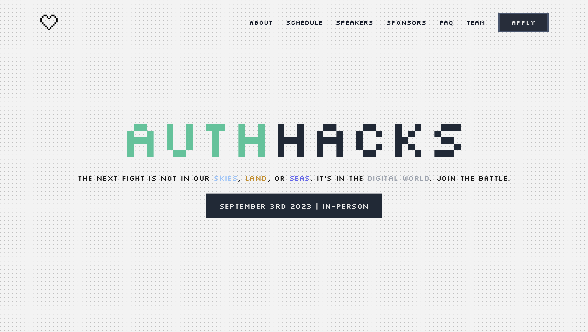

# Next.js Hackathon Template



### [Template Features](#-the-hackathon-template-comes-with-the-following-full-stack-features) 🪐 | [Tech Stack](#-made-with) ✨ | [Deploy](#-deploy) 🚀 | [Setup](#-setup-local-testing) ⚙️ | [Descope](#-descope) 🔑 | [Template Data](#-template-data) 👾 | [Airtable Setup](#-airtable-setup) 📦 | [Gallery](#-gallery) 👨‍🍳

<br />

> **_NOTE:_**  THIS IS USING NEXT.JS 12. FOR THE LATEST NEXT.JS 13 SEE THE MOST UP-TO-DATE [REPO](https://github.com/descope/nextjs-hackathon-template/).

## 🚀 The Next.js Hackathon Template comes with Next.js 12 and Authentication using NextAuth and Descope. 

## 🪐 The Hackathon template comes with the following full-stack features:

✅ [Descope](https://descope.com) NextAuth authentication 🔐 <br/>
✅ Protected pages & API routes with NextAuth. <br/>
✅ Next.js pages router, API routing protocols, and NextAuth integrations. <br/>
✅ A fully and easily customizable Home screen which features an About, Speakers, Sponsors, and FAQ section. <br/>
✅ A dedicated Team page to showcase all contributors.  <br/>
✅ A Dashboard page for Hackers to complete onboarding forms, acceptance status, and hackathon announcements. <br/>
✅ Fully responsive UI (mobile, tablet, computer). <br/>
✅ Airtable backend for hackers to signup and view hackathon details. <br/>

## ✨ Made with... 

- NextAuth (Auth.js) using Descope provider
- Flowbite
- Tailwind CSS

## 🚀 Deploy 

[](https://vercel.com/new/clone?repository-url=https%3A%2F%2Fgithub.com%2Fdescope-sample-apps%2Fnextjs-hackathon-template-pages&env=NEXTAUTH_URL,AIRTABLE_FORM_EMBED,AIRTABLE_TABLE_NAME,AIRTABLE_BASE,AIRTABLE_PERSONAL_ACCESS_TOKEN,DESCOPE_ACCESS_KEY,DESCOPE_PROJECT_ID,NEXTAUTH_SECRET)

## ⚙️ Setup: Local Testing

1. In the root directory of the project, copy the `.env.example` to `.env` by running `cp .env.example .env` and include the following:

```
NEXTAUTH_SECRET="<YOUR_NEXTAUTH_SECRET>"
NEXTAUTH_URL="<WHERE SERVER IS HOSTED (e.g. https://localhost:3000)>"

DESCOPE_PROJECT_ID="<YOUR_DESCOPE_PROJECT_ID>"
DESCOPE_ACCESS_KEY="<YOUR_DESCOPE_ACCESS_KEY>"
```

- `DESCOPE_PROJECT_ID` - can be found in your Descope's account under the [Project page](https://app.descope.com/settings/project)  
- `DESCOPE_ACCESS_KEY` - can be generated in your Descope's account under the [Access Keys page](https://app.descope.com/accesskeys)  
- `NEXTAUTH_SECRET` can be generated by the following command in your terminal: 
```
$ openssl rand -base64 32
```

2. Setup SSO 

- To enable SSO and add Descope as an Identity Provider (IdP), we need to add our flow hosting URL: 
```
https://auth.descope.io/<YOUR_DESCOPE_PROJECT_ID>
```

- Navigate to Descope Project --> Authentication methods --> Identity Provider:


2. Installation

- `npm install`
- `npm run dev`
- Open `http://localhost:3000` in your browser

## 🔑 Descope 

Descope is expected to be published as a NextAuth provider in the following months. <br />
In the mean time, we can implement a custom provider which is as easy to implement! 

Out NextAuth options can be found in ```/pages/_utils/options.ts```.  

In our ```authOptions``` we have our custom Descope provider we have attributes such as your ```clientID``` (Descope project id), ```clientSecret``` (Descope access key), and ```wellKnown``` set to Descope's OpenID Connect configuration which contains our authorization endpoints and authentication data.

```
import { NextAuthOptions } from "next-auth"


export const authOptions: NextAuthOptions = {
  providers: [
    {
      id: "descope",
      name: "Descope",
      type: "oauth",
      wellKnown: `https://api.descope.com/${process.env.DESCOPE_PROJECT_ID}/.well-known/openid-configuration`,
      authorization: { params: { scope: "openid email profile" } },
      idToken: true,
      clientId: process.env.DESCOPE_PROJECT_ID, 
      clientSecret: process.env.DESCOPE_ACCESS_KEY,
      checks: ["pkce", "state"],
      profile(profile) {
        return {
          id: profile.sub,
          name: profile.name,
          email: profile.email,
          image: profile.picture,
        }
      },
    },
  ]
}
```

Then in our ```/pages/api/auth/[...nextauth].ts``` we pass our authOptions and intialize NextAuth.
```
import NextAuth from "next-auth/next";
import { authOptions } from "../../_utils/options";


export default NextAuth(authOptions)
```

That's it! 

## 👾 Template Data
 
The template data can be found in the ```./pages/_template_data``` 


All the template data can be customized and found in the following files. <br />

To see our template data in action make your way to ```pages/index.tsx```. <br />
In the ```page.tsx``` we import the different template data and the components from our ```_components``` folder. We pass in 
our template data into these components as props that then render the data! 

## 📦 Airtable Setup 

> **_NOTE:_**  This step is Optional!

To learn more about creating a form and setting up Airtable as a database go to [Airtable.md](Airtable.md)! 

## 👨‍🍳 Gallery


<br />
<br />

## Made with ☕ + 💙